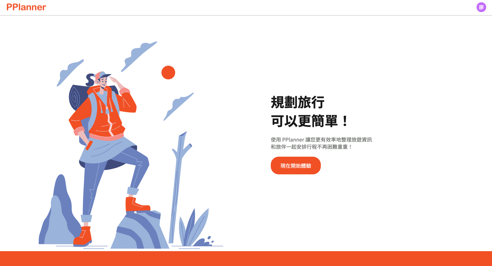
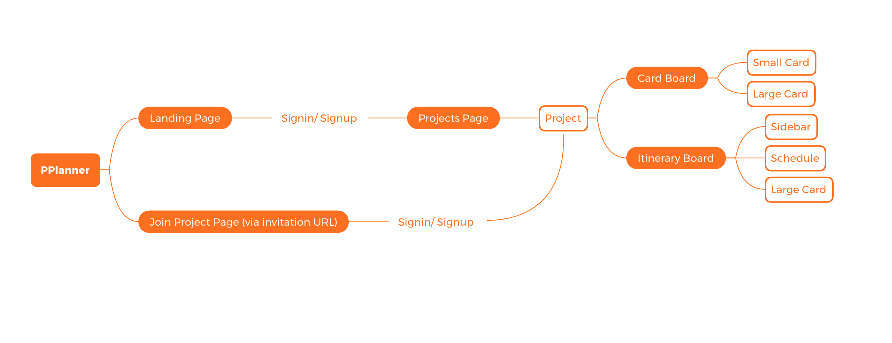
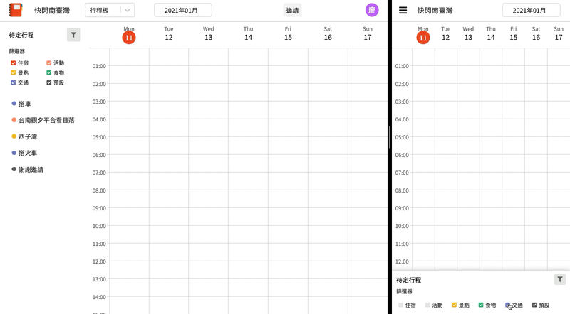

# PPlanner

A website that allows users to create trip plans, save travel information and arrange schedule with others at the same time.

## Demo

Link: https://pplanner-bfb1a.web.app/

User: test@gmail.com Password: 123456

## Technologies

- Front-End Fundamental
  - HTML / CSS / JavaScript
  - SCSS
  - RWD
- Front-End Frameworks/ Libraries
  - React (Hooks)
  - React Redux
  - Redux Toolkit
  - React Router
- Firebase
  - Authentication
  - Firestore
  - Hosting
- Others
  - react-beautiful-dnd
  - react-datepicker
  - react-dayjs
  - react-select

## Flow Chart ( 2021.01 )

## Features

### Save Travel Information to Cards

Types of data can be saved:

- Title
- Description
- Main Tags (Multiple Choice)
- Regular Tags (Up to 6 tags with Customized Name)
- Links
- Comments
- Time

### Add Card to Timetable

### Invite others to join project

### Online Collaboration

## Future Features

- Adding new appointment directly on time table
- Display more information about project, such as cards number, planned dates, members, etc..

## Contact

E-mail: <jjliao8889@gmail.com>
